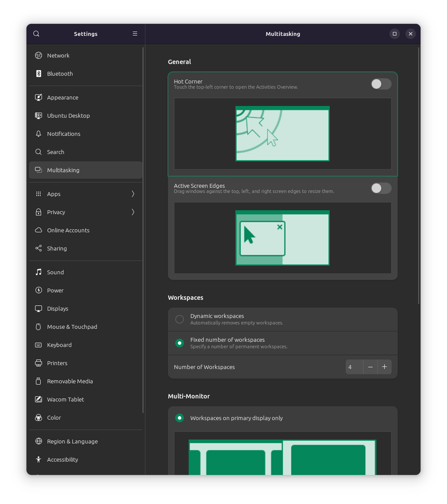
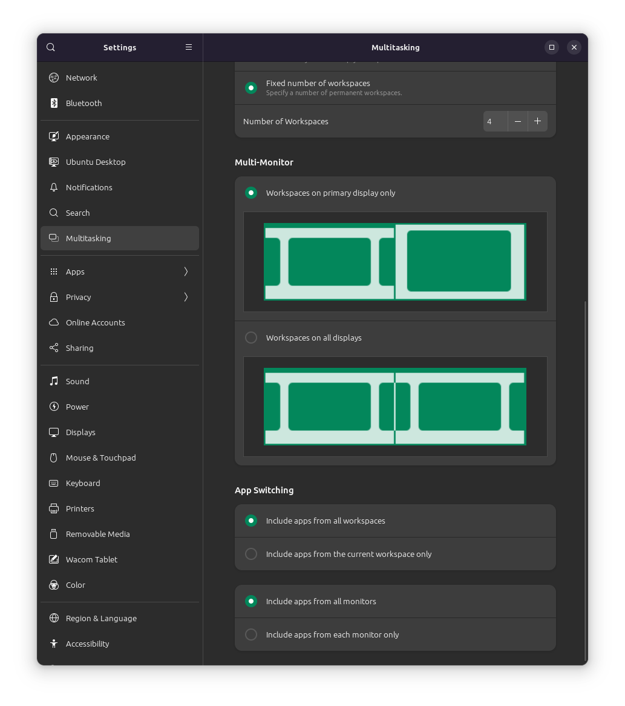

# Multitasking settings

Hot corner: Disable

Active screen edges: Disable

Workspaces: Fixed

Number of workspaces: 4

Multi-monitor: On primary only

App switching: All workspaces, all monitors

