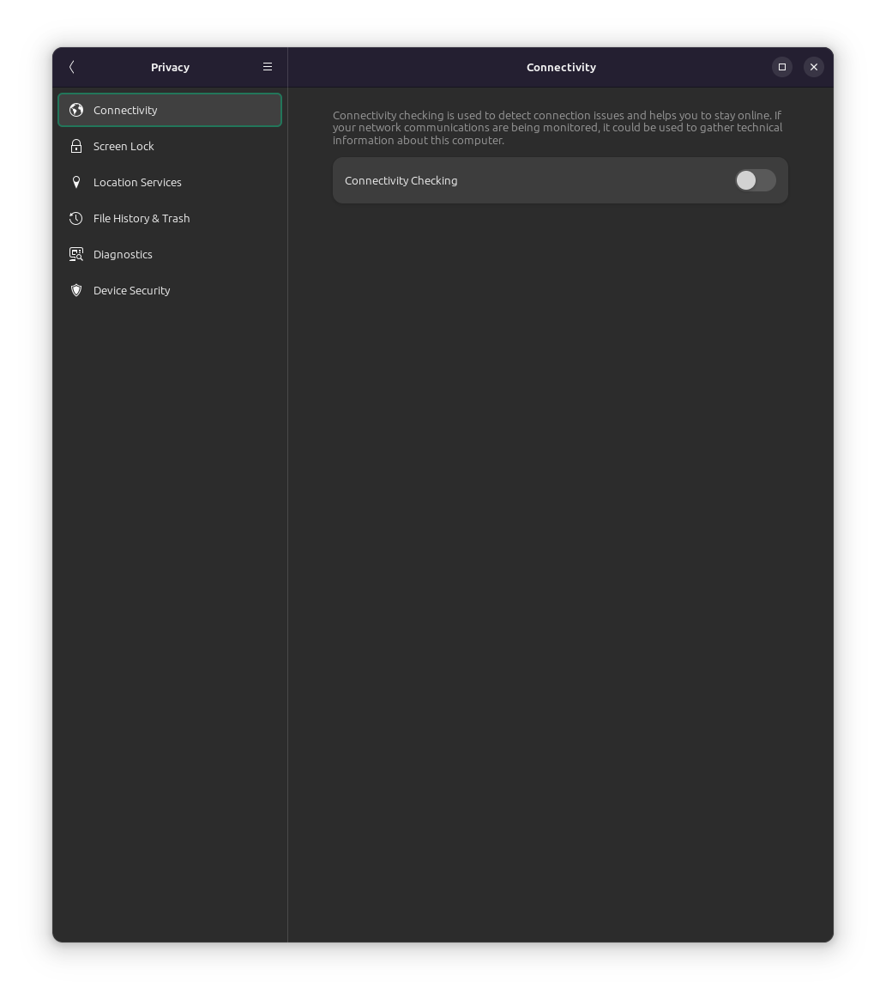
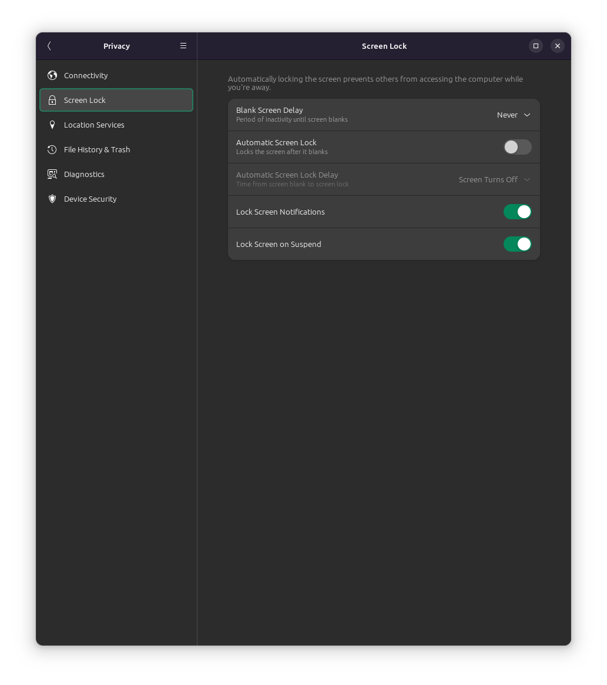
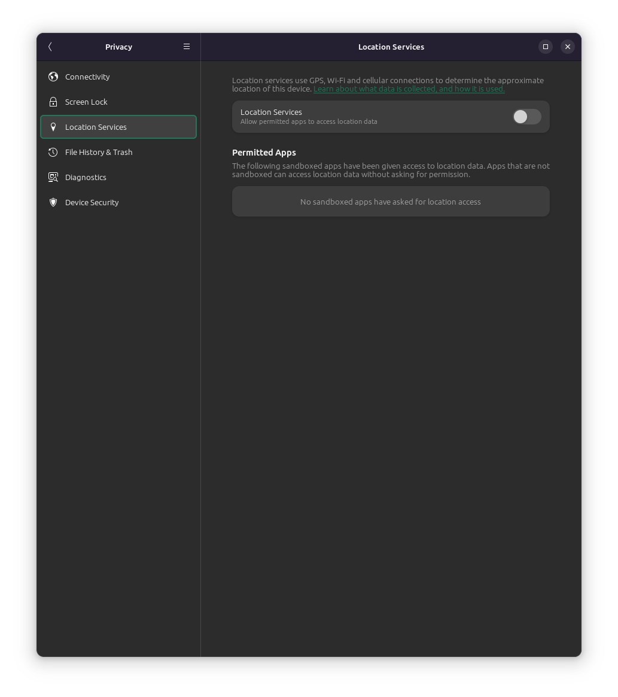
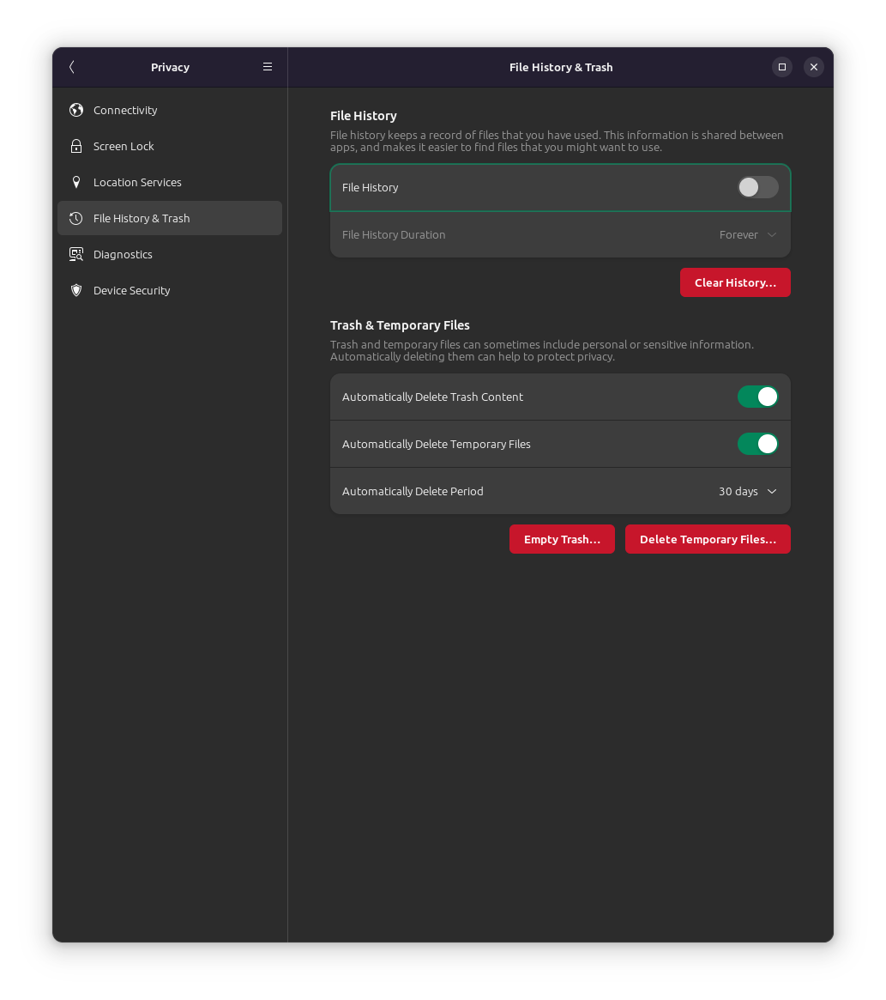
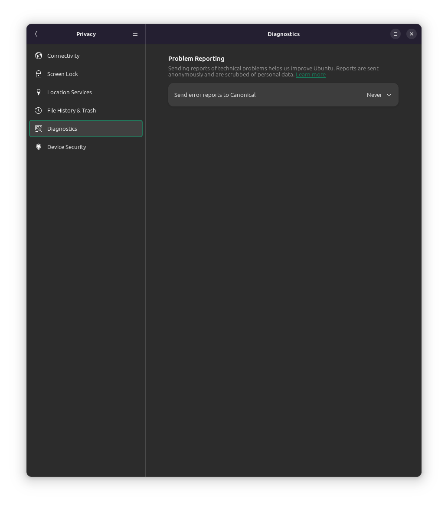

# Privacy settings

## Connectivity

Connectivity check: Disable

## Screen lock

**On my desktop:**

Blank screen delay: Never

Automatic screen lock: Disable

Lock screen notifications: Enable

Lock screen on suspend: Enable

## Location services

Location services: Disable

## File history and trash

File history: Disable

Automatically delete trash: Enable

Automatically delete temporary files: Enable

Automatic delete period: 30 days

## Diagnostics

Error reports: Never

