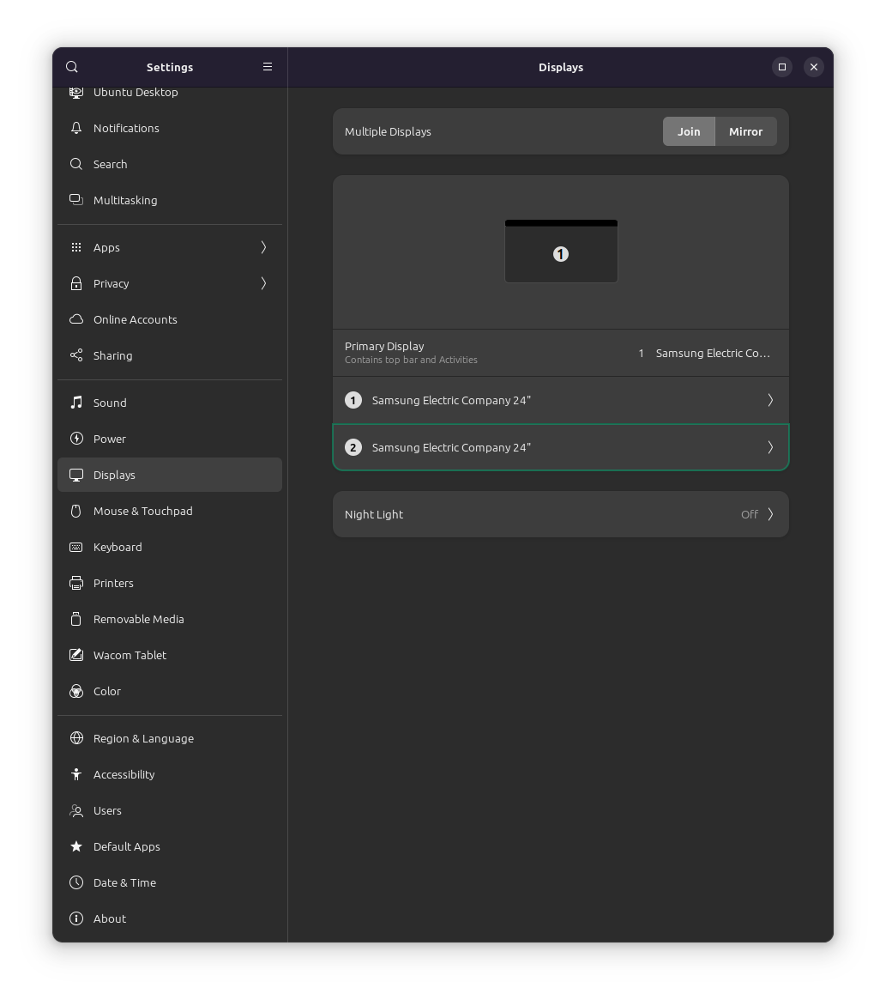
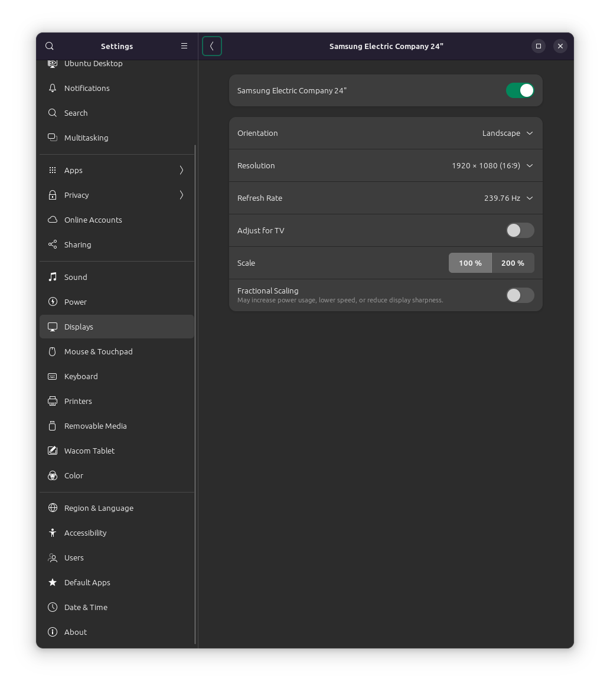
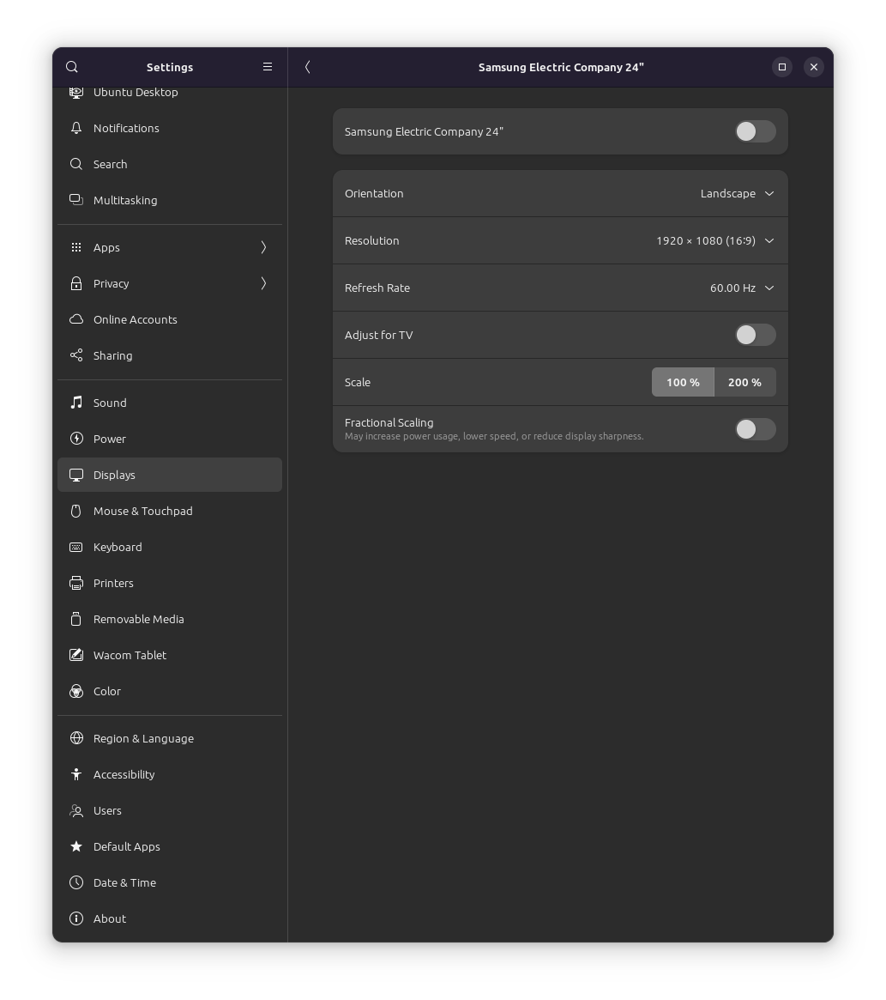

# Display settings

**On my desktop:**

Primary display: 1

Night light: Disable

**Display 1:**

Resolution: 1920x1080

Refresh rate: 239.76 Hz

Adjust for TV: Disable

Fractional scaling: Disable

**Display 2: Disable**

