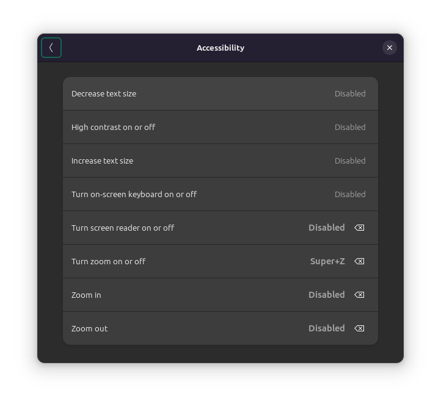
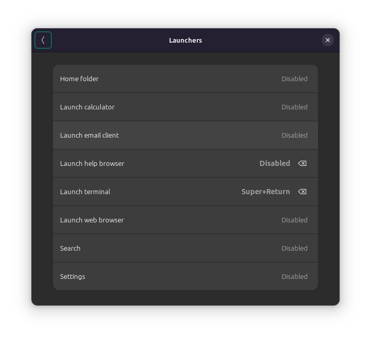
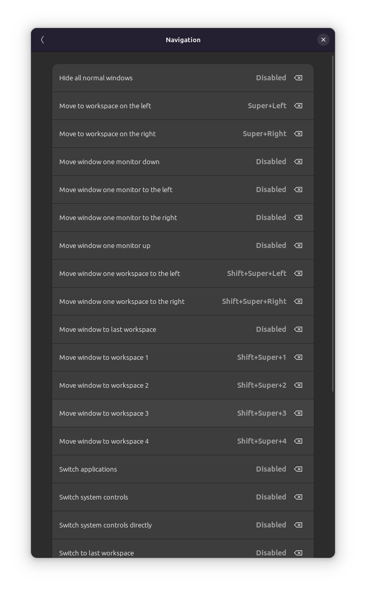
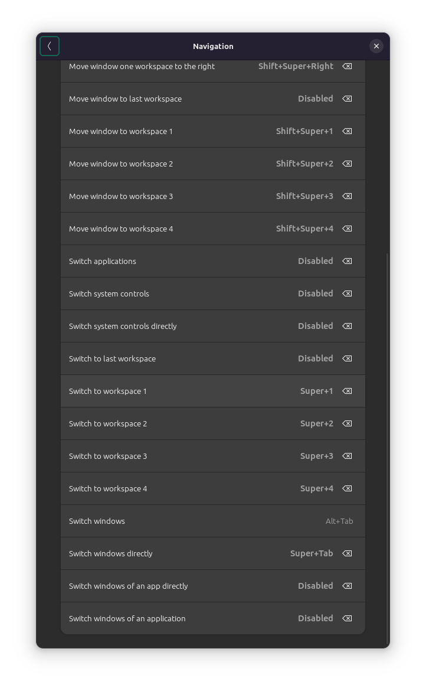
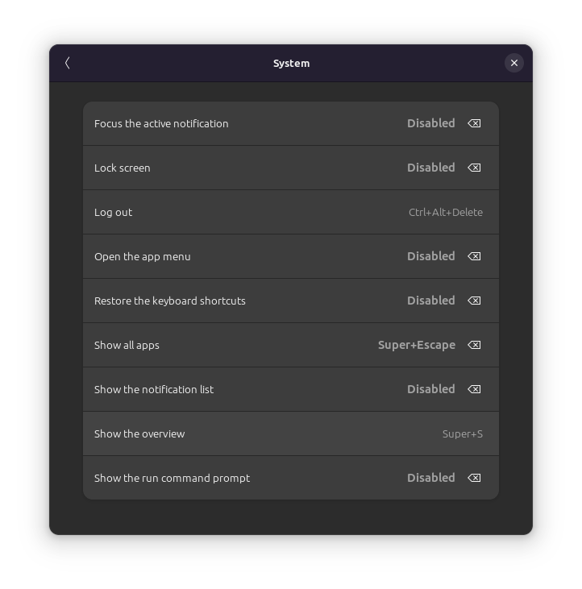
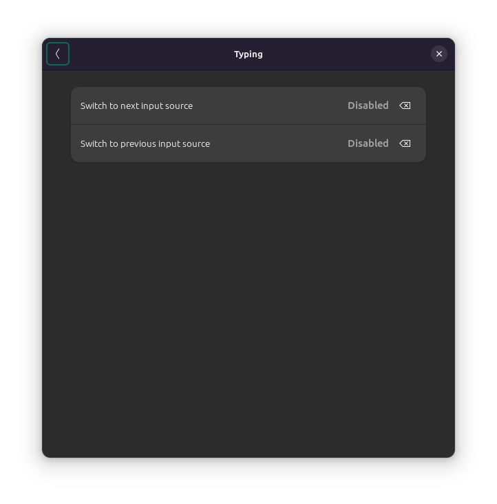
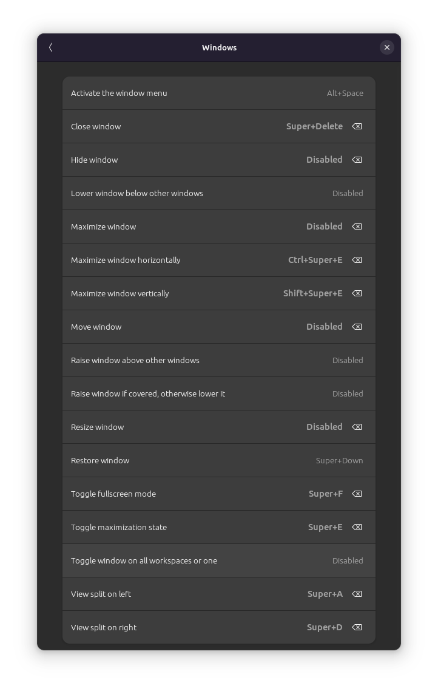

# Keyboard settings

Input sources: Finnish

## Shortcuts

### Accessibility

Screen reader on or off: Disable

Zoom on or off: Super + Z

Zoom in: Disable

Zoom out: Disable

### Launchers

Launch help: Disable

Launch terminal: Super + Return

### Navigation

Hide all normal windows: Disable

Move to left workspace: Super + Left

Move to right workspace: Super + Right

Move window one monitor down: Disable

Move window one monitor to the left: Disable

Move window one monitor to the right: Disable

Move window one monitor up: Disable

Move window one workspace to the left: Super + Shift + Left

Move window one workspace to the right: Super + Shift + Right

Move window to last workspace: Disable

Move window to workspace 1: Super + Shift + 1

Move window to workspace 2: Super + Shift + 2

Move window to workspace 3: Super + Shift + 3

Move window to workspace 4: Super + Shift + 4

Switch apps: Disable

Switch system controls: Disable

Switch system controls directly: Disable

Switch to last workspace: Disable

Switch to workspace 1: Super + 1

Switch to workspace 2: Super + 2

Switch to workspace 3: Super + 3

Switch to workspace 4: Super + 4

Switch windows: Alt + Tab

Switch windows directly: Super + Tab

Switch windows of an app directly: Disable

Switch windows of an app: Disable

### System

Focus the active notification: Disable

Lock screen: Disable

Open the app menu: Disable

Restore keyboard shortcuts: Disable

Show all apps: Super + Escape

Show the notification list: Disable

Show the run command prompt: Disable

### Typing

Switch to next input source: Disable

Switch to previous input source: Disable

### Windows

Close window: Super + Delete

Hide window: Disable

Maximize window: Disable

Maximize horizontally: Super + Control + e

Maximize vertically: Super + Shift + e

Move window: Disable

Resize window: Disable

Toggle fullscreen: Super + f

Toggle maximize: Super + e

Split left: Super + a

Split right: Super + d

