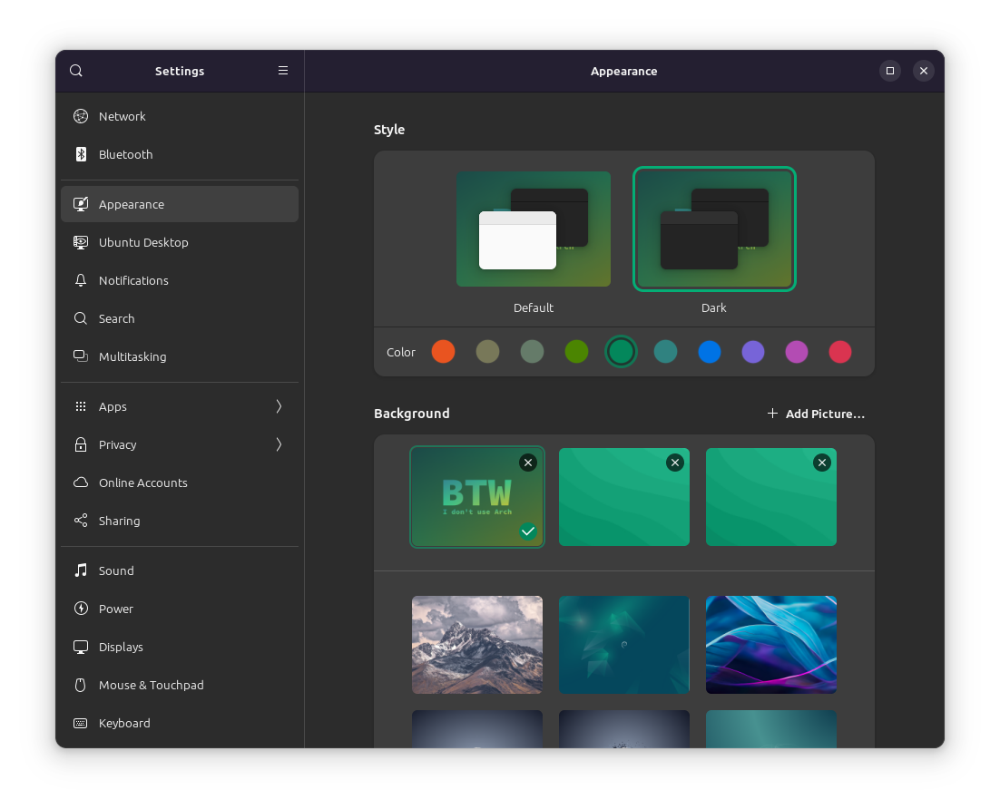

# Appearance settings

Style: Dark

Wallpaper: Check *Wallpaper* folder for the image

## Ubuntu-specific

Color: Viridian (yaru-viridian-dark theme. On a different distro, acquire the theme and enable it through Gnome Tweaks to do the same).

