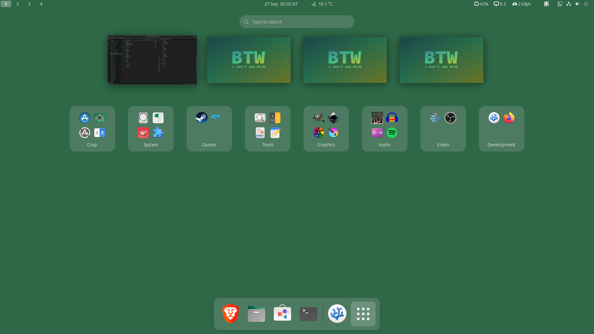

# Application menu organization

## Favourites bar

* Brave browser
* Files
* Gnome software
* Terminal

## Application folders

My apps are organized in the following folder structure:

### Crap

* Software and updates
* Additional drivers
* Software updater
* Language support
* Advanced network configuration
* Startup applications
* Passwords and keys
* Help

### System

* Disks
* Tweaks
* Dconf editor
* Extension manager
* System monitor
* Flatseal
* Login manager settings
* Settings
* ClamTk
* Timeshift

### Gamez

* Steam
* Dolphin

### Tools

* Image viewer
* Calculator
* Document viewer
* Text editor
* Videos
* LibreOffice
* LibreOffice Math
* LibreOffice Writer
* Vim

### Graphics

* GIMP
* Inkscape
* Darktable
* Krita

### Audio

* Podcomb
* Audacity
* Sound recorder
* Spotify

### Video

* Kdenlive
* OBS

### Development

* VSCodium
* Firefox