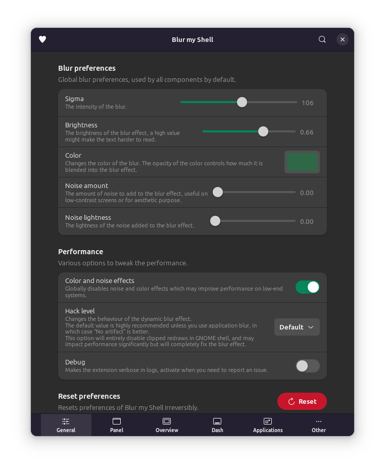
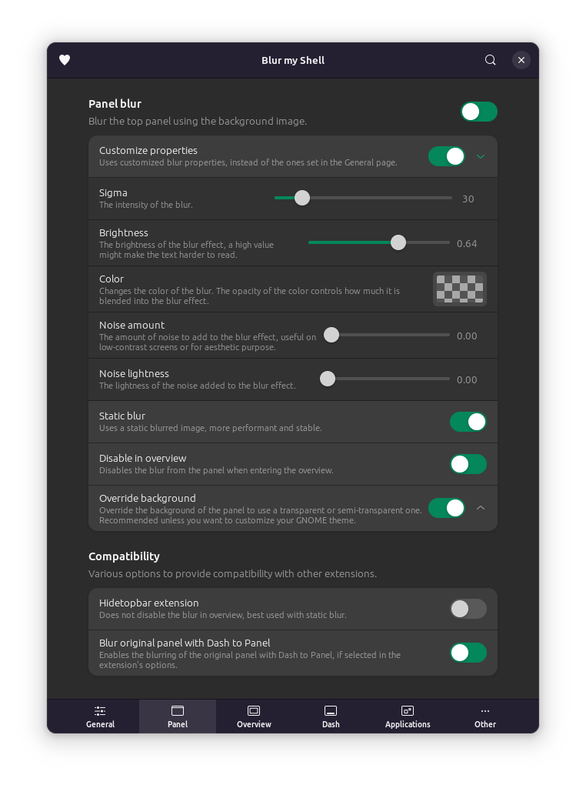
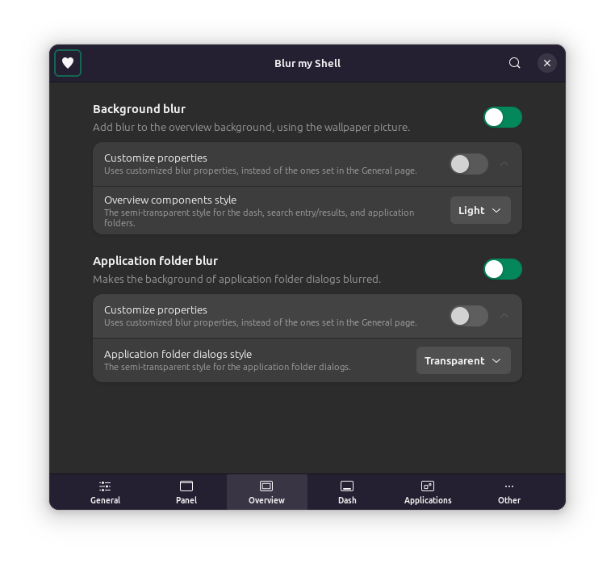

# Blur my Shell

## General

Sigma: 106

Brightness: 0.66

Color: #2E6847 100% opacity

Noise: 0

Color and noise effects: Enable

## Panel

Customize properties: Enable

Sigma: 30

Brightness: 0.64

Noise: 0

Static blur: Enable

Disable in overview: Enable

Override background: Enable

## Overview

### Background

Customize properties: Disable

Component style: Light

### Application folder

Customize properties: Disable

Dialogs style: Transparent

