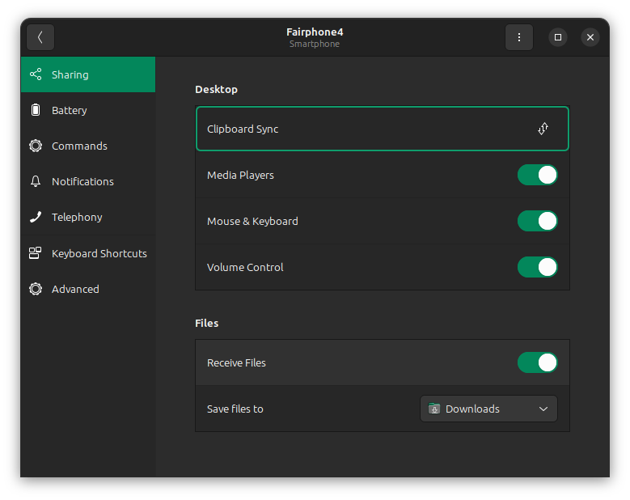
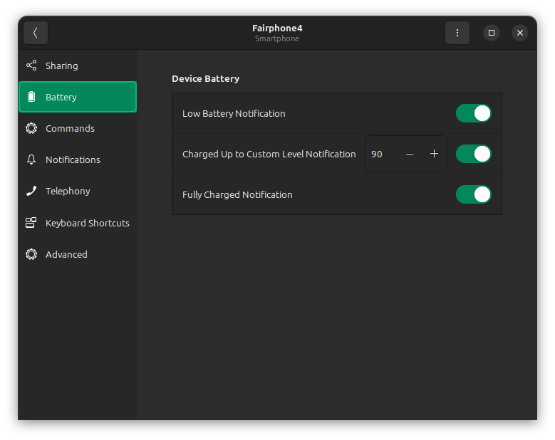
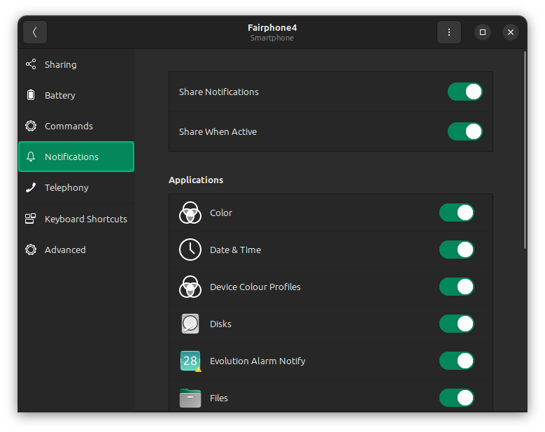

# GSConnect

Display mode: User menu

## Sharing 

Media players: Enable

Mouse and Keyboard: Enable

Volume control: Enable

Receive files: Enable

Save files to: Downloads

## Battery

Low battery notification: Enable

Charge up to custom level notification: 90

Fully charged notification: Enable

## Notifications

Share notifications: Enable

Share when active: Enable

## Advanced 

Enable everything