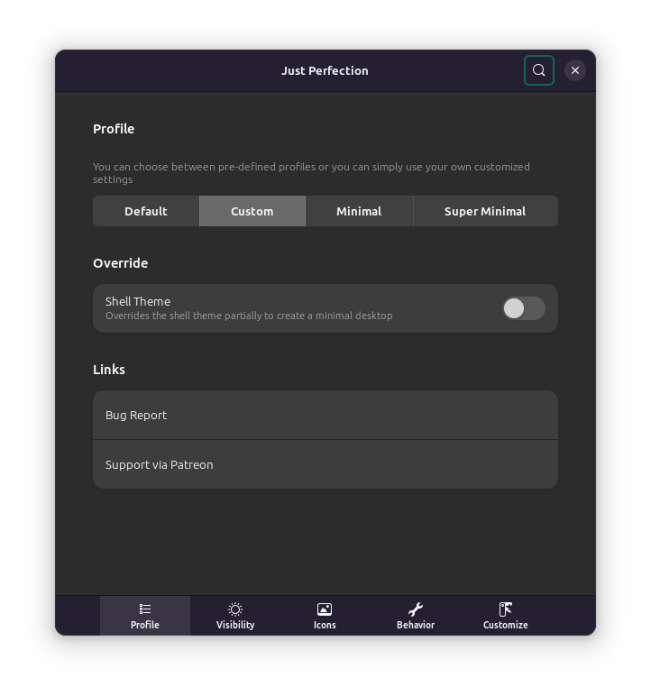
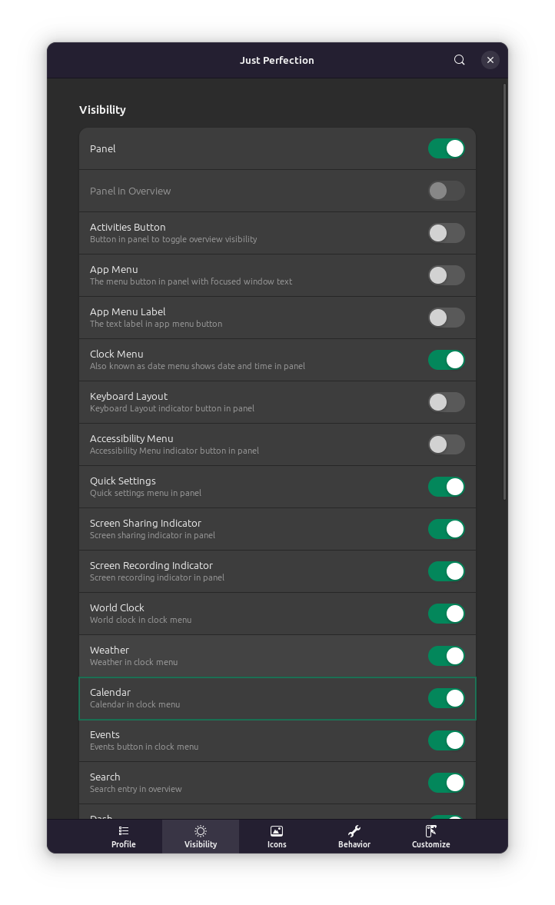
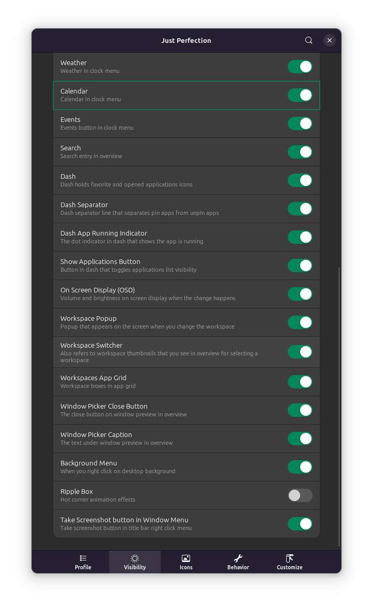
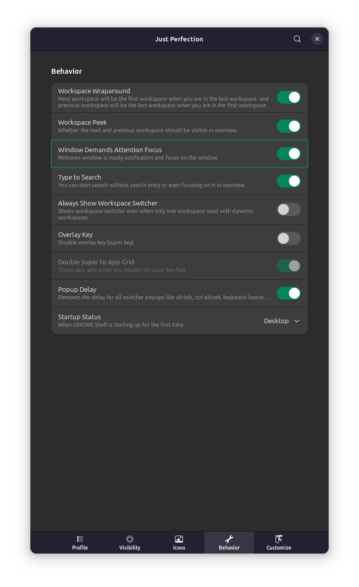
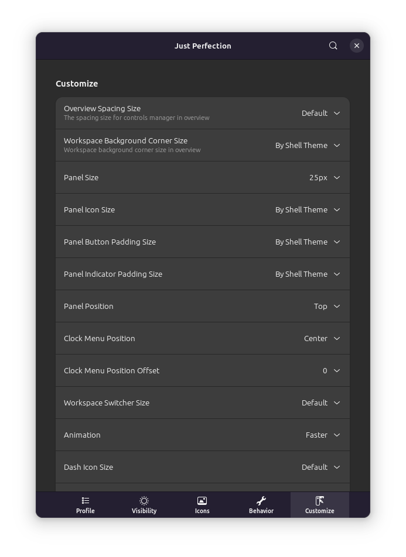

# Just Perfection

## Profile

Custom

Shell theme: Disable

## Visibility

Panel: Enable

Activities button: Disable

App menu: Disable

App menu label: Disable

Keyboard layout: Disable

Accessibility menu: Disable

Ripple box: Disable

## Behavior

Workspace wrap: Enable

Workspace peek: Enable

Window demands attention focus: Enable

Type to search: Enable

Overlay key: Disable

Popup delay: Enable

Startup status: Desktop

## Customize 

Panel size: 25px

Animation: Faster

