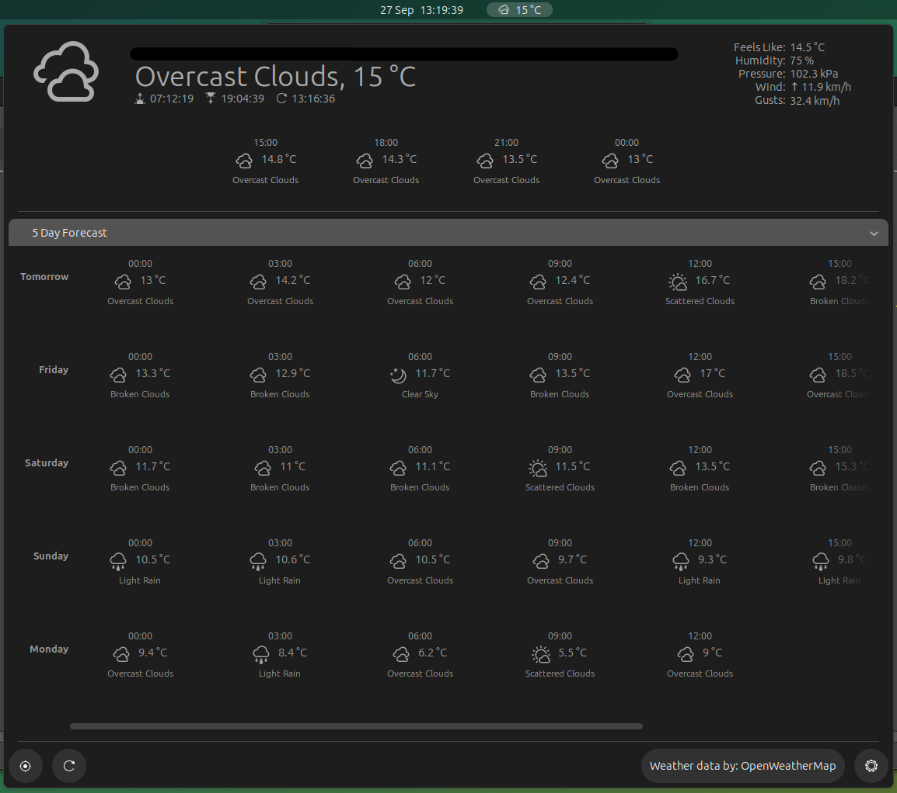
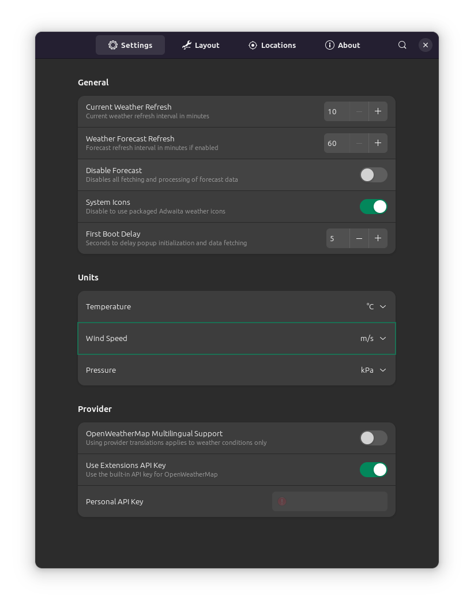
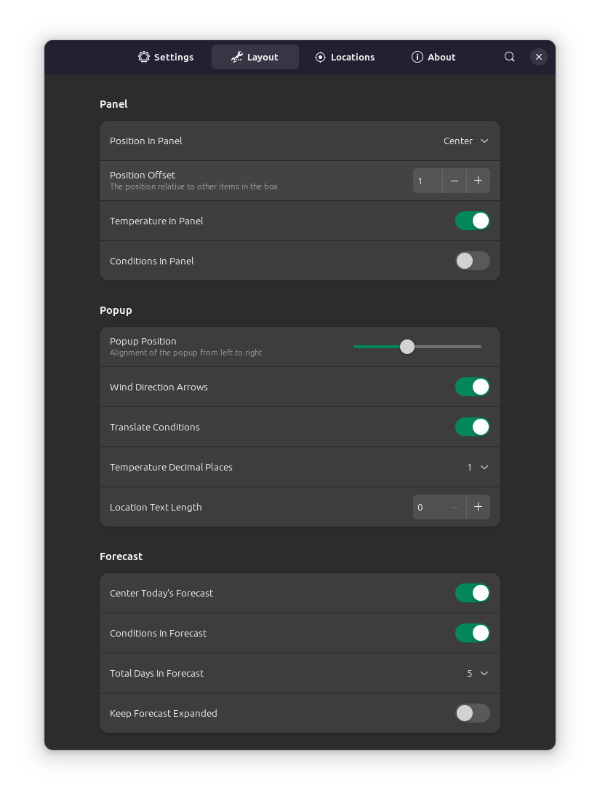

# OpenWeather

## Settings

Current refresh: 10

Forecast refresh: 60

Disable forecast: Disable (have forecast)

System icons: Enable

First boot delay: 5

Temperature: C

Wind speed: m/s

Pressure: kPa

## Layout

Position: Center

Offset: 1

Temp in panel: Enable

Conditions in panel: Disable

Popup position: Slightly left (see image)

Wind direction arrows: Enable

Temperature decimal places: 1

Location text length: 0

Center today's forecast: Enable

Conditions in forecast: Enable

Days in forecast: 5

Keep forecast expanded: Disable

