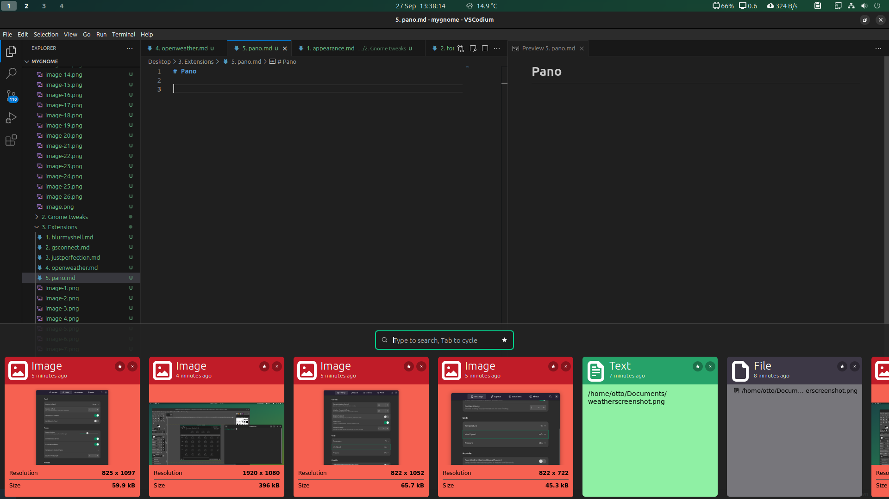
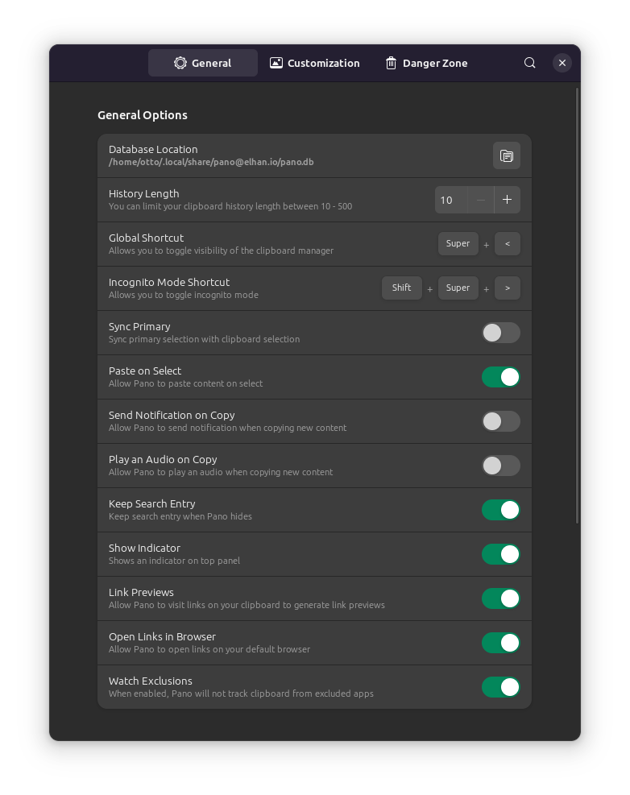
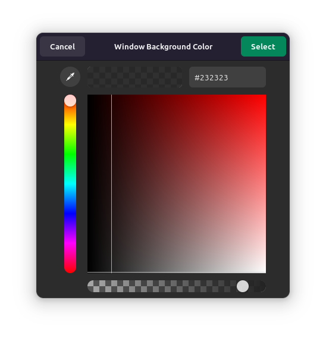
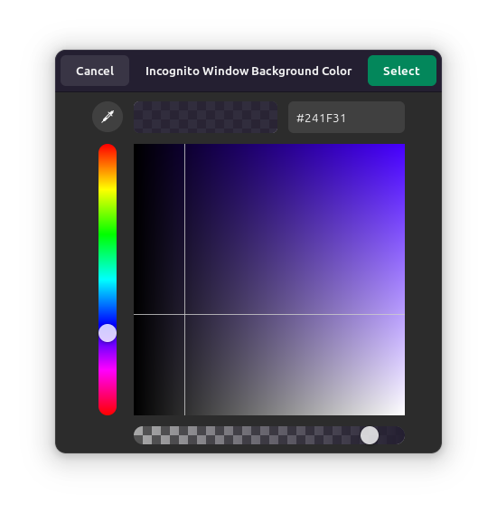
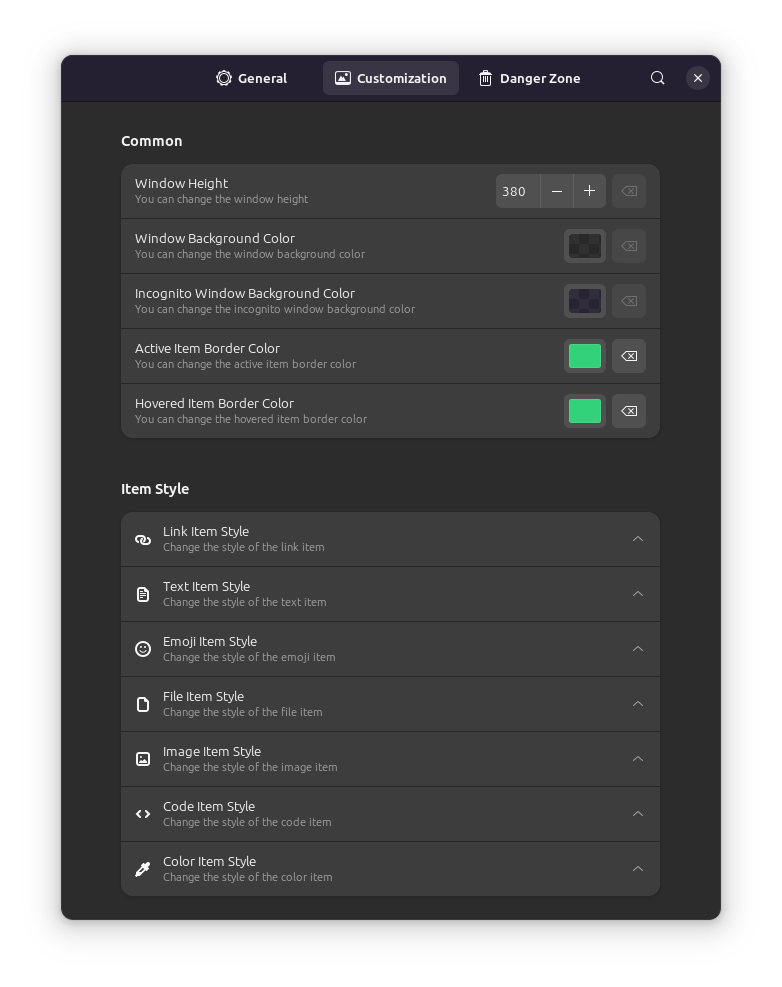

# Pano

## General

History length: 10

Global shortcut: Super + <

Incognito shortcut Super + Shift + <

Sync primary: Disable

Paste on select: Enable

Send notification on copy: Disable

Play audio on copy: Disable

Show indicator: Enable

## Customization

Window height: 380

Window bg color: #232323 Opacity slightly before full (see image)

Incognito window bg color: #241F31 Opacity same as above

Active item border color: #33D17A

Hovered item border color: #33D17A

### Link item style

Header bg color: #3584E4

Header text color: #FFFFFF

Body bg color: #62A0EA

Metadata bg color: #62A0EA

Metadata title color: #000000

Title font: 13

Title color: #000000

Description font: 12

Description color: #000000

Link color: #000000

Link font: 10

### Text item style 

Header bg color: #26A269

Header text color: #FFFFFF

Body bg color: #8FF0A4

Body text color: #000000

Body font: 14

Character length: 600

#### Others are default