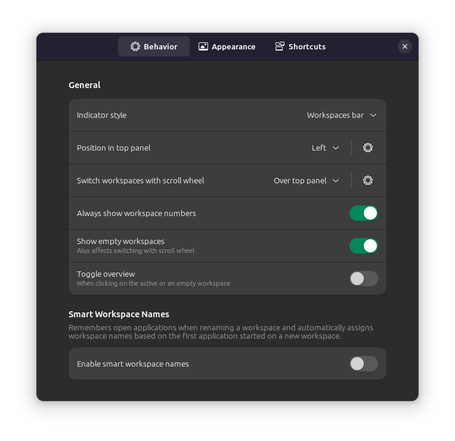
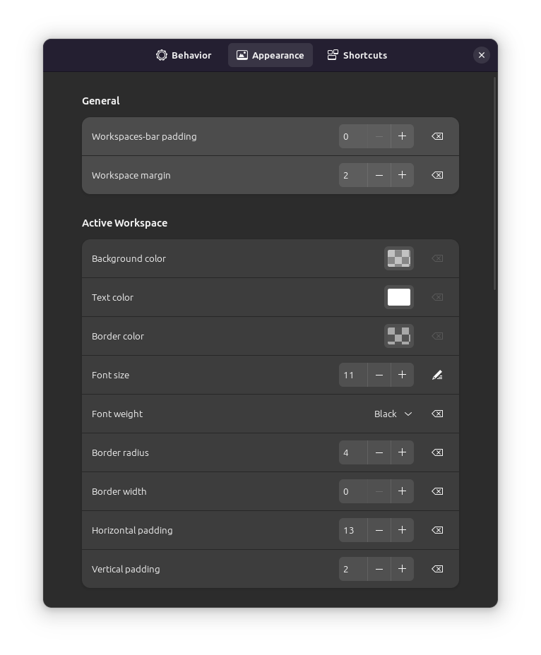

# Space Bar

## Behavior

Indicator style: Workspaces bar

Position: Left

Switch workspaces with scroll: Over top panel

Always show workspace numbers: Enable

Show empty workspaces: Enable

Toggle overview: Disable

Smart workspace names: Disable

## Appearance

Padding: 0
Margin: 2

### Active

Bg color: #FFFFFF (About a quarter opacity, see image)

Text color: #FFFFFF

Border color: Transparent

Font size: 11

Font weight: Black

Border radius: 4

Border width: 0

Horizontal padding: 13

Vertical padding: 2

### Inactive

Bg color: Transparent

Text color: #FFFFFF

Border color: Transparent

### Empty

Bg color: Transparent

Text color: #FFFFFF (half opacity)

Border color: Transparent
