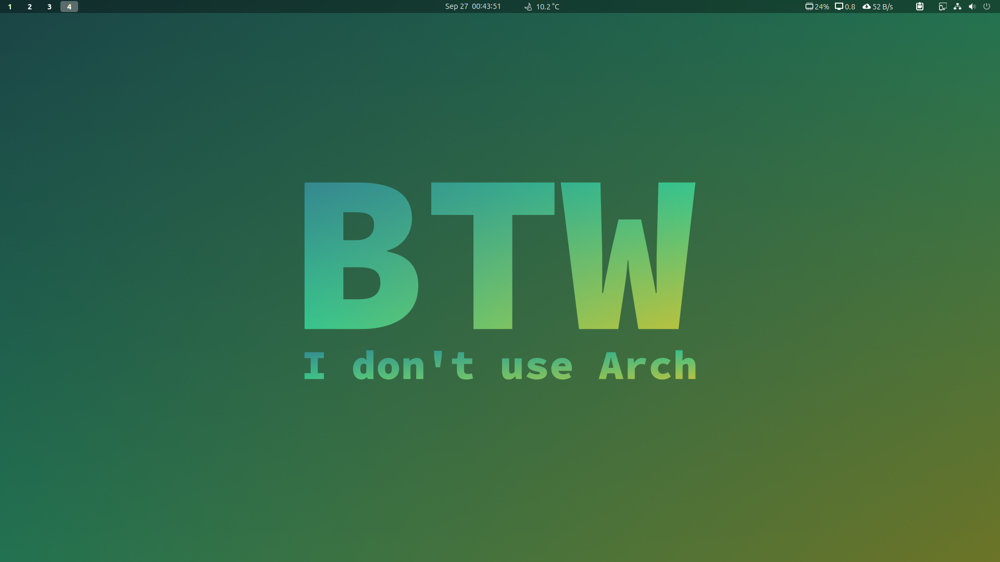
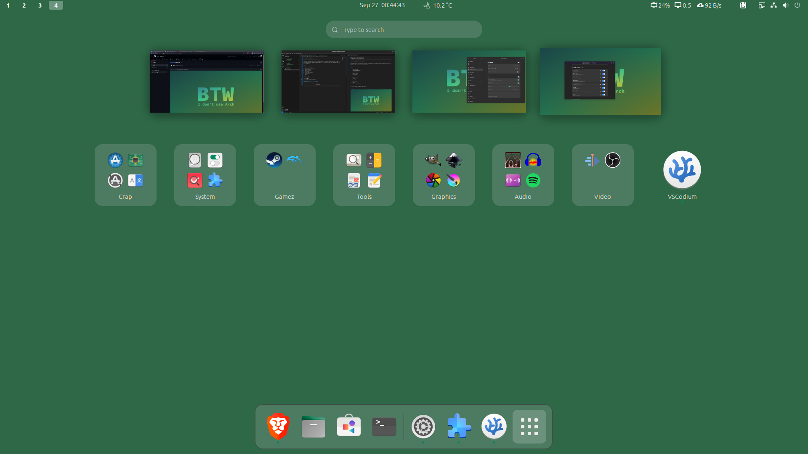
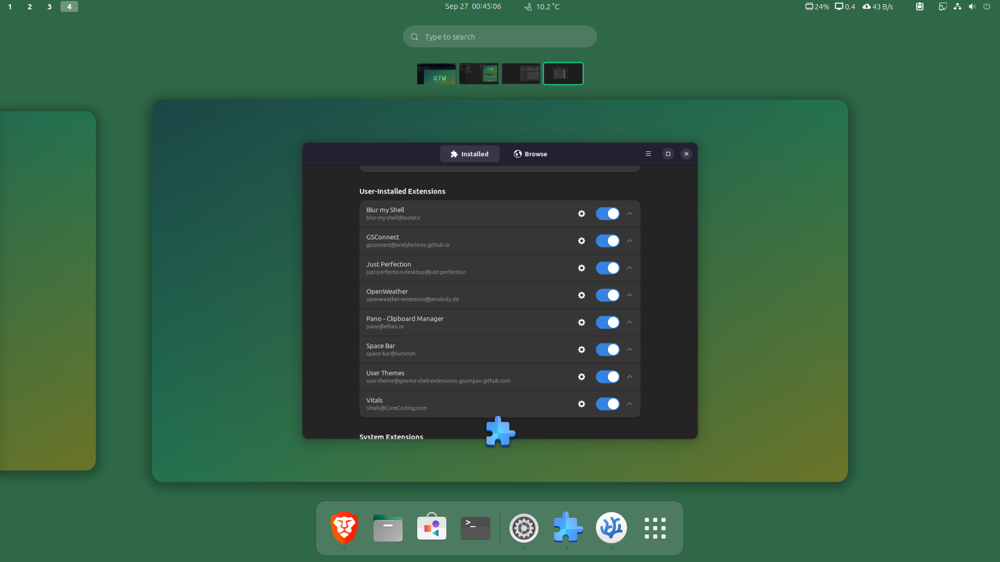
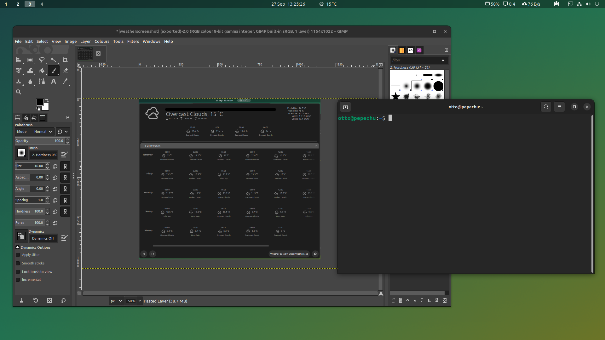

# My Gnome Setup
### Work in progress

My gnome configuration documented.

In this repository, I have a collection of folders with markdown files explaining how I made my gnome work as it does. Gnome is bad with dotfiles, so this is my approach. I document everything that I have changed, so I don't explicitly mention stuff that is obviously in a default state.

This is currently based on gnome 44. 

There are 2 folders
* Desktop - Configuration on my desktop
* Laptop - Configuration on my laptop

Index:
1. Stock settings and desktop config
2. Gnome tweaks
3. Extensions

## Screenshots of the desktop

